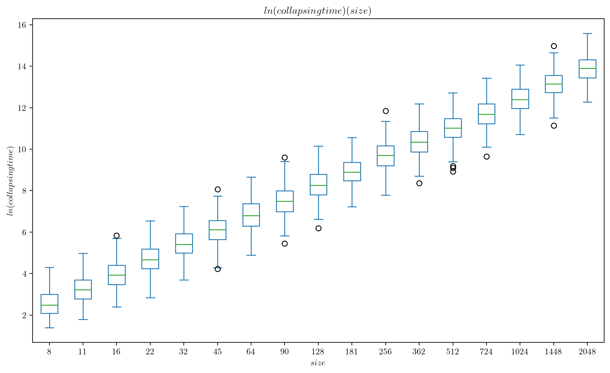
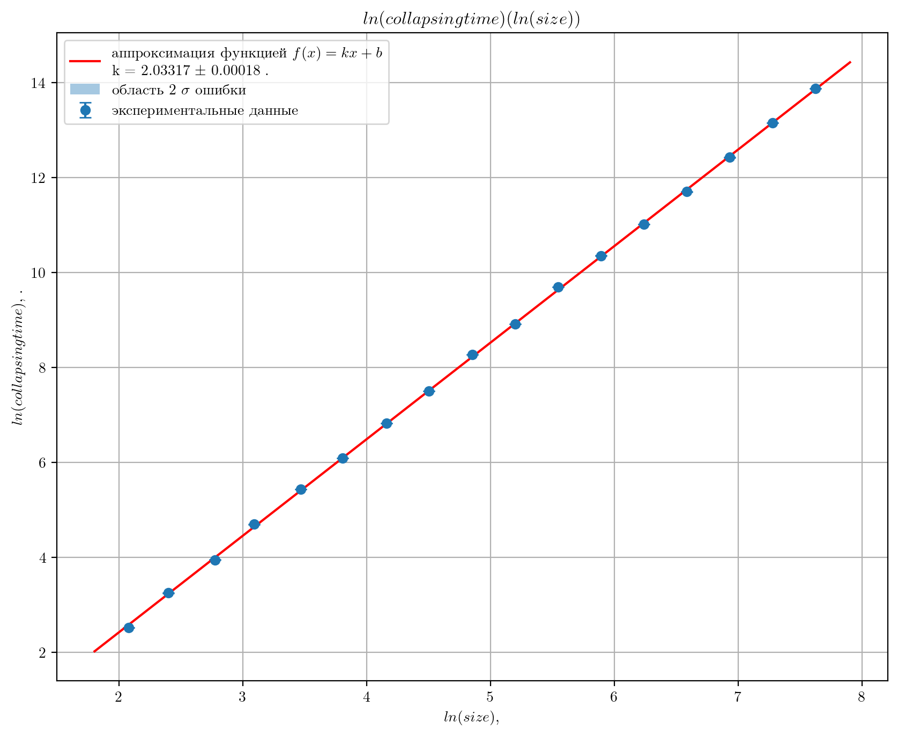
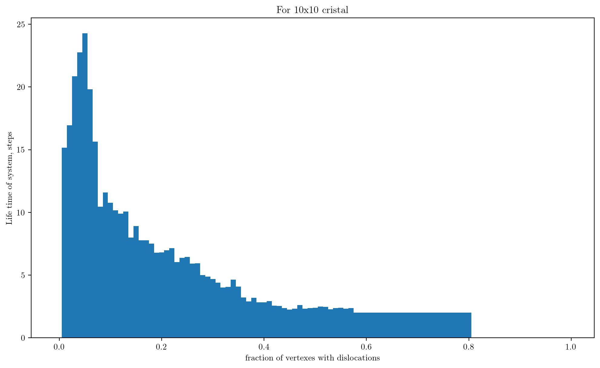
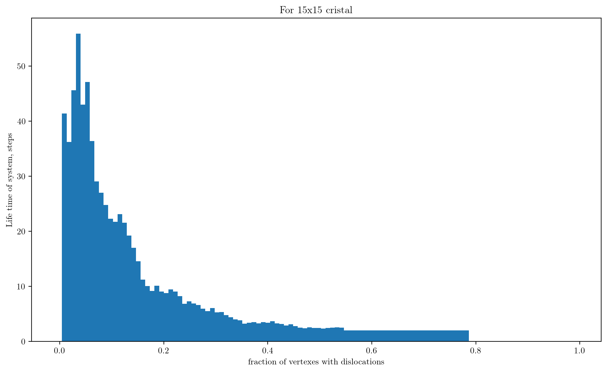
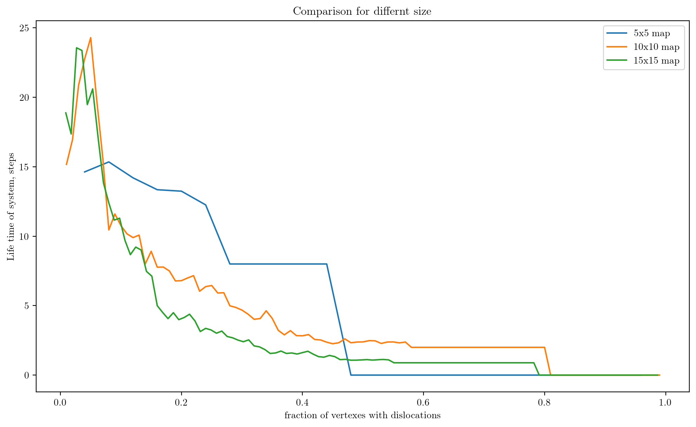

# Время окончания движения для карт разного размера

Функция, моделирующая движение дислокаций в кристалле - *simulater.cpp*

В первой части эта функция запускается из файла *one_particle_launcher.cpp*. Он считывает из входного потока размер кристалла, расположение единственной дислокации и колличество моделирований, которые ему нужно провести. В выходной поток выводятится количество шагов до достижения дислокацией края кристалла.

Эта программа компилируется и итеративно запускается из python программы *one_iterator.py* для разных размеров кристалла. Эта программа собирает результаты моделирования в структуру DataFrame бибилиотеки pandas и в таком формате они обрабатываются в python notebook'е *analisation.ipynb*

В результате получась такая зависимость.

Так как масштаб логарифмический, а зависимость выглядит линейной, вероятнее всего в начальном масшбале зависимость степенная. Найдем степень, аппроксимировав зависимость линейной.

Угловой коэффициент получился равным 2, значит время жизни пропорционально квадрату размера(стороны кристалла), значит пропорцинально площади кристалла. Точнее формула такая

T = 0.19*space^2

# Время окончания в зависимости от пропорции заполнения

Протестируем на карте размером 10х10.
Выбираем случайный набор дислокаций на поле и моделируем, пока не стабилизируется. Зависимость времени стабилизации от доли заполненния карты предсавлена на графиках для двух размеров карт и их сравнение на следующем. Для каждой доли заполнения значение усреднялось по 100-200 запускам

При сравнении значения нормировались на площадь запускаемой карты, что разумно исходя из результатов прошлого пункта.

Видно, что сначала время жизни может немного увеличиться, так как дислокаций, которые должны встретиться с препятствием становится больше. Но потом, и чем больше карта, тем скорее, при увеличении доли зполнения время жизни резко падает, так как дислокации начинают слипаться.

В текстовых файлах example содержатся примеры запусков на карте 10х10 для 10% и 30% заполнения
